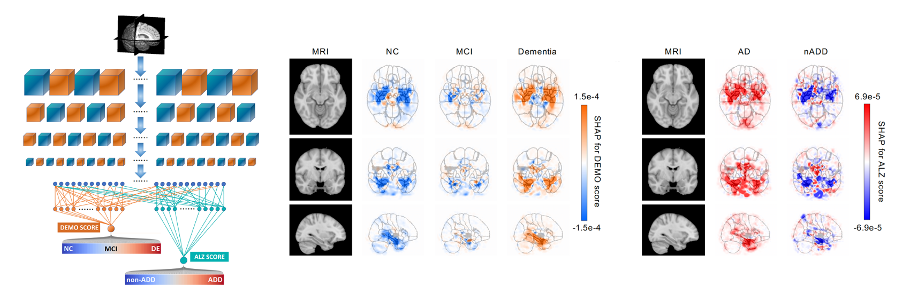

# Multimodal deep learning for Alzheimer's disease dementia assessment

## Introduction
This repository contains the implementation of a **deep learning framework** that accomplishes 2 diagnostic steps to identify persons with normal cognition (NC), mild cognitive impairment (MCI), Alzheimer’s disease (AD) dementia, and dementia due to other etiologies (nADD).  

We demonstrated that the framework compares favorably with the diagnostic performance of **neurologists and neuroradiologists**. To interpret the model, we conducted **SHAP (SHapley Additive exPlanations)** analysis on brain MRI and other features to reveal disease-specific patterns that correspond with expert-driven ratings and neuropathological findings.  



### Prerequisites

The tool was developed using the following dependencies:

1. PyTorch (1.10 or greater).
2. NumPy (1.19 or greater).
3. tqdm (4.31 or greater).
4. nibabel (3.2 or greater).
5. matplotlib (3.3 or greater).
6. scikit-learn (0.23 or greater).
7. scipy (1.5.4 or greater).
8. shap (0.37 or greater).
9. xgboost (1.3.3 or greater).
10. catboost (0.24 or greater).

Please note that the dependencies may require Python 3.6 or greater. It is recommended to install and maintain all packages using [`conda`](https://www.anaconda.com/) or [`pip`](https://pypi.org/project/pip/). For installation of GPU accelerated PyTorch, additional effort may be required. Please check the official websites of [PyTorch](https://pytorch.org/get-started/locally/) and [CUDA](https://developer.nvidia.com/cuda-downloads) for detailed instructions.

### Installation
Recommend to only clone the last version to avoid getting all commits during the development stage. 
```bash
git clone --depth 1 https://github.com/vkola-lab/ncomms2022.git
```

## Documentation

### Train a model

#### 1. Train a CNN model
The *model_wrappers.py* contains the interfaces for initializing, training, testing, saving, loading the model as well as creating SHAP interpretable heatmaps. See below for a basic example usage.  

```python
from model_wrappers import Multask_Wrapper
from utils import read_json

model = Multask_Wrapper(
    tasks=['ADD', 'COG'],                            # a list of tasks to predict
    device=1,                                        # GPU device to use
    main_config=read_json('config.json'),            # general configuration for the experiment  
    task_config=read_json('task_config.json'),       # task specific configurations
    seed=1000
)                                       
model.train()                                                            
thres = model.get_optimal_thres()                    # get optimal threshold using validation dataset
model.gen_score(['test'], thres)                     # apply optimal threshold on test dataset and cache predictions
```

#### 2. Train a Fusion/NonImg model
The interface for training a fusion model or non-imaging model is similar to that of the CNN model. See below for a basic example usage.  

```python
from nonImg_model_wrappers import NonImg_Model_Wrapper, Fusion_Model_Wrapper
from utils import read_json

model = NonImg_Model_Wrapper(
    tasks=['ADD', 'COG'],                            # a list of tasks to predict
    main_config=read_json('config.json'),            # general configuration for the experiment  
    task_config=read_json('task_config.json'),       # task specific configurations
    seed=1000
)                                       
model.train()                                                            
thres = model.get_optimal_thres()                    # get optimal threshold using validation dataset
model.gen_score(['test'], thres)                     # apply optimal threshold on test dataset and cache predictions

model = Fusion_Model_Wrapper(
    tasks=['ADD', 'COG'],                            # a list of tasks to predict
    main_config=read_json('config.json'),            # general configuration for the experiment  
    task_config=read_json('task_config.json'),       # task specific configurations
    seed=1000
)                                       
model.train()                                                            
thres = model.get_optimal_thres()                    # get optimal threshold using validation dataset
model.gen_score(['test'], thres)                     # apply optimal threshold on test dataset and cache predictions
```

Note:
1. The **Multask_Wrapper** class defines a **generic multi-task** deep learning model which has shared convolutional blocks for feature extracting and standalone task-specific MLPs for classification or regresssion. 
2. Model's **weights** will be stored under the subfolder of ***checkpoint_dir*** that corresponds to each experiment. 
3. Model's **predictions** along with labels will be saved as a csv file under the subfolder of ***tb_log*** corresponding to each experiment so that performance evaluation solely depends on the outputed csv without doing the inference again.  

### Evaluate a model
Since the ***gen_score*** method has already saved the raw predictions in csv, the evaluation pipeline just needs to look for those information from the corresponding experimental folders under ***tb_log***. Mean, std or 95% confidence intervals are estimated using multiple independent experiments, for instance, from five-fold cross validation.
#### 1. ROC/PR curves
```python
from performance_eval import generate_roc, generate_pr
generate_roc(
    csv_files,              # list[csvfiles] produced from "gen_score". Mean and std are estimated from cross-validation experiments  
    positive_label, 
    color, 
    out_file
)
generate_pr(
    csv_files,              # list[csvfiles] produced from "gen_score". Mean and std are estimated from cross-validation experiments 
    positive_label, 
    color, 
    out_file
)
```
#### 2. Performance table
The performance table contain accuracy, sensitivity, specificity, F-1, MCC for different tasks. 
```python
from performance_eval import perform_table
perform_table(
    csv_files,              # list[csvfiles] produced from "gen_score". Mean and std are estimated from cross-validation experiments
    output_name             # any name for the output csv file that contains metric information
)
```
#### 3. Confusion matrix
```python
from performance_eval import crossValid_cm(csv_files, stage)
crossValid_cm(
    csv_files,              # list[csvfiles] produced from "gen_score". Mean and std are estimated from cross-validation experiments
    stage                   # if stage='test', confusion matrix for the test dataset will be generated
)
```
#### 4. Full evaluation package
This full package compiled ROC/PR, performance table and confusion matrix all together.
```python
from performance_eval import whole_eval_package
whole_eval_package(model_name, 'test')         # evaluate on NACC testing set
whole_eval_package(model_name, 'OASIS')        # evaluate on OASIS dataset
```

### Interpret models with SHAP

#### 1. Interpret the CNN model (MRI saliency map)
The *shap_mid* method will load pretrained weights first and then generates the **SHAP** interpretable saliency map for a specific middle layer over all instances. 
```python
model = Multask_Wrapper(   # instantiate an already trained model
    tasks=['ADD', 'COG'],                            
    device=1,                                        
    main_config=read_json('config.json'),       
    task_config=read_json('task_config.json'),       
    seed=1000
)                                                                                                
model.shap_mid(
    task_idx=0,            # if task_idx == 0, the shap analysis will be about the ADD task (tasks[task_idx])
    path='somewhere/',     # where you want to save the generated shap numpy array
    file='test.csv',       # shap will be genareted on each case from this file
    layer='block2conv'     # which layer of the model that you want to interpret 
)                                       
```
For more details, please see the [SHAP](https://shap-lrjball.readthedocs.io/en/latest/)

#### 2. Interpret the Fusion/NonIng model (feature importance)
The *shap* method will initialize corresponding SHAP explainer for various models, including XGBoost, CatBoost, Random Forest, Decision Tree, Support Vector Machine, Nearest Neighbor, Multi-layer Perceptron. See below for an example.

```python
model = NonImg_Model_Wrapper(
    tasks=['ADD', 'COG'],                            # a list of tasks to predict
    main_config=read_json('config.json'),            # general configuration for the experiment  
    task_config=read_json('task_config.json'),       # task specific configurations
    seed=1000
)                                       
model.train()                                                            
thres = model.get_optimal_thres()                    # get optimal threshold using validation dataset
model.gen_score(['test'], thres)                     # apply optimal threshold on test dataset and cache predictions
shap_values, _ = model.shap("test_shap")             # get shap values for all features over instances from test dataset
```
 
### Data visualization 
Please find the scripts used for plotting from the ***FigureTable/*** folder.

## Data Preparation
To follow the data distribution policy from different study centers, we provided guidance on accessing and processing meta information instead of sharing the data within this repo. The meta data contains demographic information, medical history, neuropsychological tests, and functional questionaires. Please refer to our paper for a complete list of the features included. 

#### 1. Meta information
We collected and organized meta data from 8 cohorts in the folder structure as below:

    lookupcsv
    │
    ├── raw_tables         # inside raw_tables, you should save the directly-downloaded tables.  
    │   ├── NACC_ALL       # within each folder, there is a readme file to guide the user to access and dowload data   
    │   │   ├── readme.txt 
    │   ├── ADNI
    │   ├── OASIS
    │   ├── AIBL
    │   ├── FHS
    │   └── ...
    │
    ├── derived_tables     # inside raw_tables, you should save the directly-downloaded tables.
    │   ├── NACC_ALL       # within each folder, there is a readme file to guide the user to run processing scripts that we provided 
    │   │   ├── readme.txt
    │   ├── ADNI
    │   ├── OASIS
    │   ├── AIBL
    │   ├── FHS
    │   └── ...
    │
    ├── dataset_table      # this is where the final meta table is saved
    │   ├── NACC_ALL
    │   ├── ADNI
    │   ├── OASIS
    │   ├── AIBL
    │   ├── FHS
    │   └── ...
    │
    ├── CrossValid         # concate meta tables from dataset_table/ and then split NACC into train, valid, test                  
    │   ├── cross0         # different cross contains different split, see our paper for more details on how the split was done
    │   │   ├── train.csv  
    │   │   ├── valid.csv
    │   │   ├── test.csv
    │   │   ├── OASIS.csv
    │   │   ├── exter_test.csv
    │   ├── cross1              
    │   ├── cross2             
    │   ├── cross3            
    │   └── cross4            
    └── ...

To prepare for the meta data, 
(1) download data from offical data portals using the guidance from readme and save those in ***raw_tables***
(2) use the scripts provided in ***derived_tables*** to produce intermediate outcome
(3) use the scripts provided in ***dataset_table*** to produce the final meta table using the information from both raw_tables and derived_tables
(4) concate and split data for ***cross-validation***

#### 2. MRI processing
The pipeline for MRI processing is available in ***MRI_process/pipeline.sh***. There are 4 sample de-identified and processed MRI scans in ***demo/mri/***.

## DEMO
We also provide a demo script (***demo_inference.py***) to demonstrate how to generate inference on other data instances using pretrained CNN weights. 
```
python demo_inference.py
```
Running the command above will produce a csv table under demo/ folder which contains the model's predictions on those 4 MRI scans from ***demo/mri/***. 
